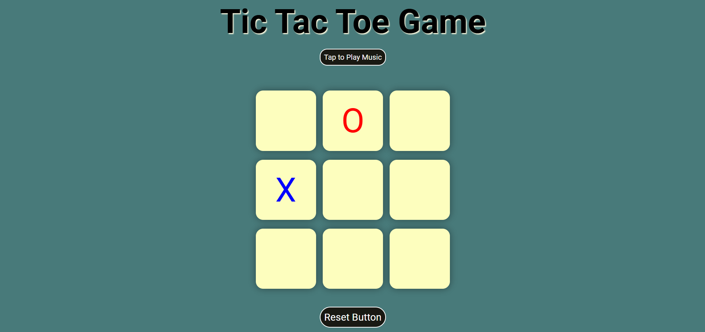
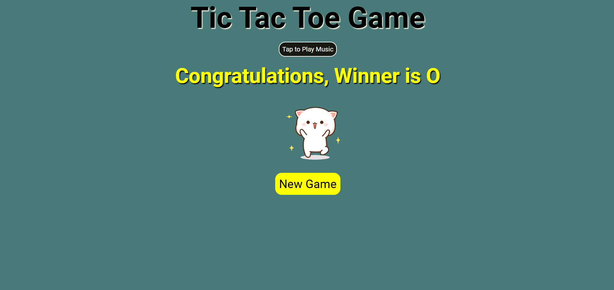

# Tic-Tac-Toe Game

A classic Tic-Tac-Toe game implemented with HTML, CSS, and JavaScript. This simple yet fun game allows two players to compete against each other by marking X and O on a 3x3 grid until one of them wins or the game ends in a draw.

---

## 🕹️ **Game Features:**

- **Player vs Player**: Enjoy the classic Tic-Tac-Toe experience with two players taking turns to mark 'X' and 'O'.
- **Interactive UI**: A clean, minimalistic design ensures a smooth and engaging user experience, allowing you to focus on the game.
- **Tap to Play Music**: Play or pause the background music anytime during the game, adding an extra layer of fun.
- **Winning Sound & Effects**: Celebrate victories with a sound effect when a player wins, and enjoy a distinct draw sound for ties.
- **Winning GIF**: When a player wins, a celebratory GIF is displayed to make the experience even more exciting.
- **Responsive Design**: Play the game seamlessly on both desktop and mobile devices, adapting to different screen sizes.
- **Reset Button**: Easily restart the game with a click of the reset button, giving you endless play opportunities.
- **Automatic Winning Logic**: The game automatically detects winning combinations and draws, so you can focus on the gameplay.

---

## 🚀 **How to Play:**

1. Open the `index.html` file in your browser.
2. The game board will appear with a 3x3 grid.
3. Player 1 will be 'O' and Player 2 will be 'X'.
4. Players take turns clicking on empty squares to place their marks.
5. The game automatically checks for a winner after each move.
6. If a player wins, the game will display a victory message.
7. If the board is filled and there is no winner, the game will declare a draw.
8. You can reset the game anytime using the **Reset** button.

---

## 📸 **Screenshots:**

### 1. Game in Progress
This screenshot shows the game in progress, with Player 1 (O) and Player 2 (X) taking their turns.

### 2. Winner Message
This screenshot shows the game after a player wins, with a message displaying the winner. In this case, **O** is the winner.

---

## 🔧 **Technologies Used:**

- **HTML**: Structure of the game board and UI elements.
- **CSS**: Styling for the game grid and user interface.
- **JavaScript**: Game logic for player turns, win detection, and reset functionality.

---

## 💡 **Contributing:**

1. Fork this repository.
2. Clone the repository to your local machine.
3. Create a new branch (`git checkout -b feature-name`).
4. Make changes and commit them (`git commit -m 'Added new feature'`).
5. Push to the branch (`git push origin feature-name`).
6. Open a pull request to merge your changes.

---

### Happy Playing! 🎮
